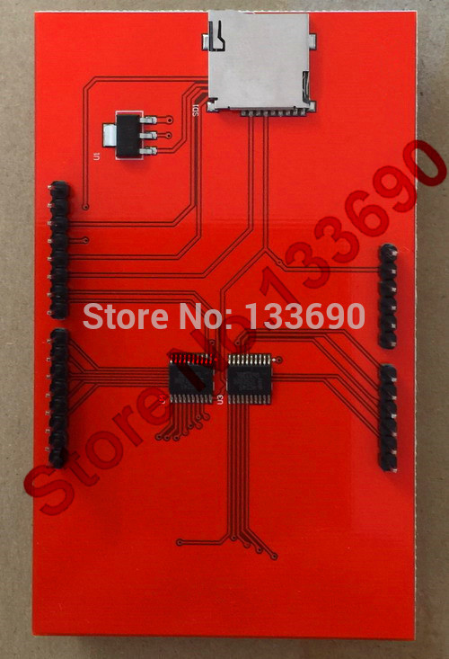
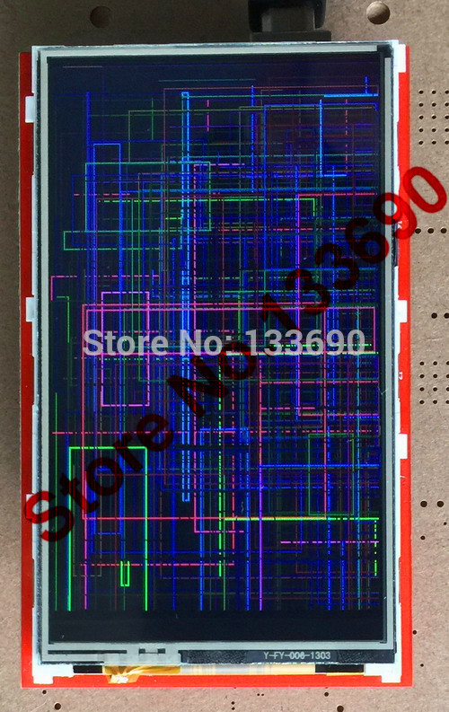

# CodeAsm's variant on Adafruit library for 8-bit TFT LCDs such as ILI9325, ILI9328, etc

This is a library for a specific TFT display using the ILI9341 controller. its resolution and calls will have been altered to suit my needs

These displays use 8-bit parallel to communicate, 12 or 13 pins are required to interface (RST is optional).

Adafruit invests time and resources providing this open source code, please support Adafruit and open-source hardware by purchasing products from Adafruit! I, CodeAsm also support this statement, go buy some stuff from them, as I did, except this display im using.

Written by Limor Fried/Ladyada for Adafruit Industries. BSD license, check license.txt for more information. Modified by Nico Vijlbrief/CodeAsm

All text above must be included in any redistribution (all text? go buy and support them https://www.adafruit.com/)

To install, use your brain, use the original library: https://github.com/adafruit/TFTLCD-Library
Your on your own here.